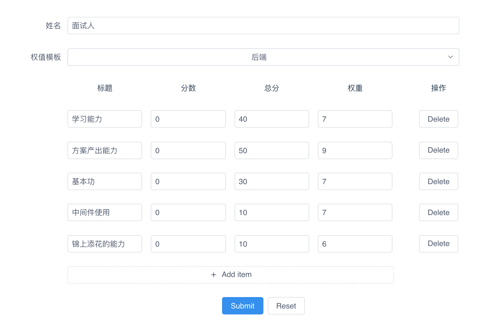

# hire-tools
A simple project for interview and employ.
You can use it by [https://wangerzi.github.io/hire-tools/](https://wangerzi.github.io/hire-tools/)

## Purpose
For the technology interview, we can view the ability about the candidate.

## Operation
At first, you can manage the categoary, score, total score and the weights, on this page.



Then click the submit button, and you can got a radar map for the candidate, the `score = sum(item.score) / sum(item.total) * 100`


## Project setup
```
npm install
```

### Compiles and hot-reloads for development
```
npm run serve
```

### Compiles and minifies for production
```
npm run build
```

### Lints and fixes files
```
npm run lint
```

## LICENCE

Hire-tools is licensed under the Apache License, Version 2.0. See [LICENSE](https://github.com/GitbookIO/gitbook/blob/master/LICENSE) for the full license text.