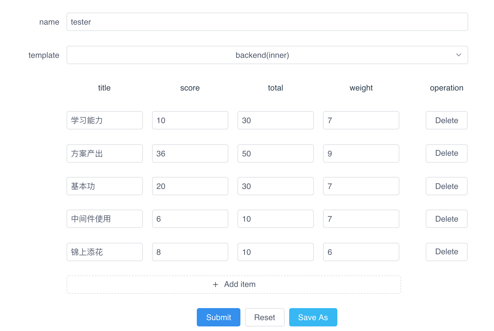
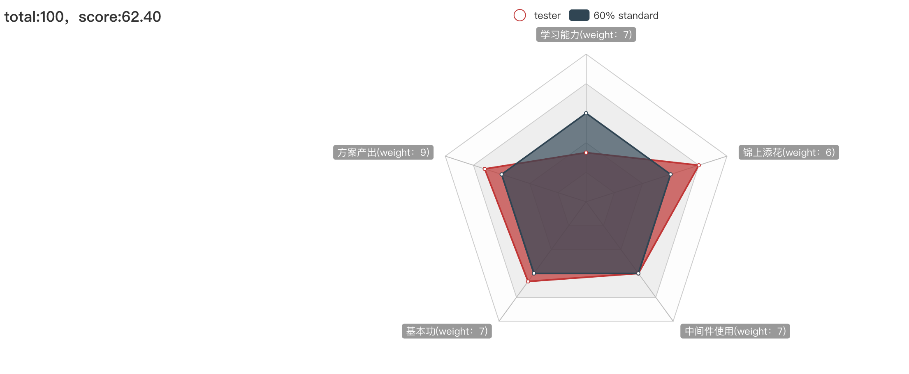
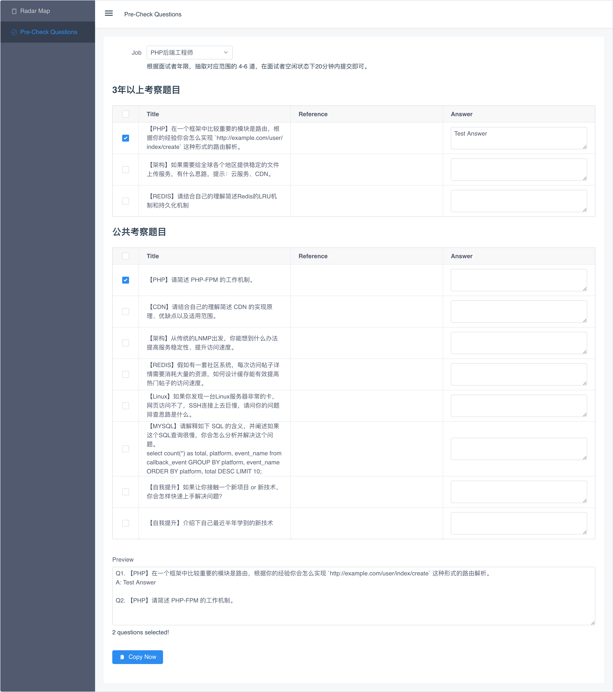

# hire-tools
A simple hire tools for interview, contains radar charts, pre check questions select, etc.
You can use it by open this url: [http://hire-tools.wj2015.com/index.html](http://hire-tools.wj2015.com/index.html)

## Purpose
For the technology interview, we can view the ability about the candidate, and HR always choose some questions from question bank and let the interviewee answer it.

## Features

- [x] Basic render charts.
- [x] Save customize template
- [ ] Manage customize template
- [ ] Record interview comment online.
- [x] Question record and copy to use.
- [x] Random questions quickly
- [ ] Automatic publish project by docker image.

## Operation

### Radar chart
At first, you can edit the categoary, score, total score and the weights, on this page, and you can save this as a local template (only this browser).



Then click the submit button, and you can got a radar map for the candidate, the `score = sum(item.score) / sum(item.total) * 100`



### Pre-Check Questions
You should select job first, and choose questions what you want to ask, you can also write the answer that the interviewee writes.



## Project setup
```
npm install
```

### Compiles and hot-reloads for development
```
npm run serve
```

### Compiles and minifies for production
```
npm run build
```

### Lints and fixes files
```
npm run lint
```

## LICENCE

Hire-tools is licensed under the MIT License. See [LICENSE](https://github.com/GitbookIO/gitbook/blob/master/LICENSE) for the full license text.

